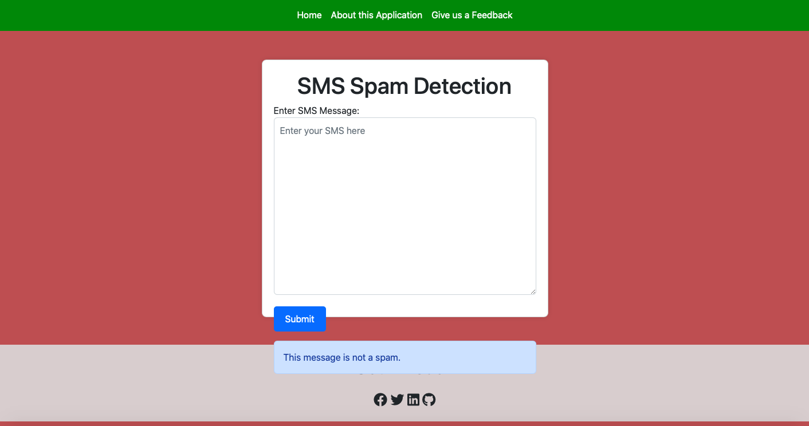

# SMS Classifier Model

This project involves the development of a machine learning model for a text classification model to classify SMS as either spam or non-spam using data science techniques in Python. This project was part of my tasks as a Data Science Intern with Bharat.

The model was built using a dataset containing SMS messages labeled as either non-spam or spam. The classification model was based on the Multinomial Naive Bayes algorithm.

### Requirements

<li>Python (>=3.6)
<li> Required Python packages (install using pip install):
    <ul>
    <li>Flask</li>
    <li>pandas</li>
    <li>scikit-learn</li>
    <li>Matplotlib</li>
    <li>Seaborn</li>
    <li>nltk (Natural Language Toolkit)</li>
    <li>joblib</li> 
</ul>

### Model Development

The model is developed using the following steps:

<li>Data Loading and Exploration: The dataset is loaded, and exploratory data analysis is performed to understand its structure.</li>
<li>Data Preprocessing: Text data is preprocessed by removing stopwords and stemming words.</li>
<li>Model Training: A Multinomial Naive Bayes classifier is trained on the preprocessed text data.</li>
<li>Model Evaluation: The model is evaluated on a test set, and performance metrics such as accuracy, confusion matrix, and classification report are obtained.</li>
<li>Flask User Interface: A simple web-based user interface was created using Flask for users to input SMS messages and receive spam detection results.</li>

### Model Evaluation

The model achieved an impressive accuracy of 98.39%, demonstrating its efficacy in correctly categorizing SMS messages. The low numbers of false positives and false negatives, as indicated in the confusion matrix, underscore the model's reliability.

### Project Structure

<li>app.py: Flask application for the user interface.</li>
<li>templates/index.html: HTML template for the user interface.</li>
<li>spam_detection_model.joblib: Saved model file.</li>
<li>spam_detection_vectorizer.joblib: Saved vectorizer file.</li>
<li>dataset.csv: CSV file containing the SMS dataset.</li>
</ul>

### Setup

Clone this repository into your computer system
Install required Python packages as listed above
Run the Flask application (type python app.py in your terminal).
Access the user interface at http://127.0.0.1:5000/ in your web browser.
Enter an SMS message into the input form and submit to see the spam detection result.

Check the deployed version of this model here: http://smsclassifier.pythonanywhere.com

### Acknowledgments

The dataset used for training and evaluation was sourced from https://www.kaggle.com.

### Note

This model was trained using sms dataset with 5572 entries. You may wish to train the model with more robust data to get different and better results.

### Author

**
Ese Amadasun**

**
Github:** https://github.com/amadasunese

**
Linkedin:** https://www.linkedin.com/in/amadasun-ese/
 
**
Twitter:** https://www.twitter.com/amadasunese
